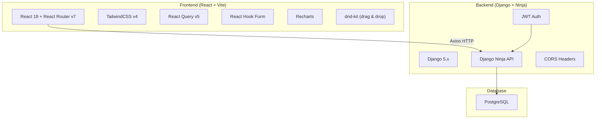
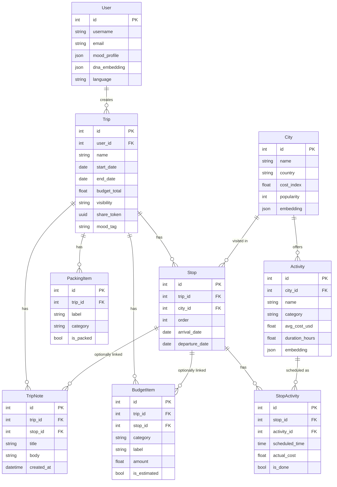

# 🌍 Traveloop – Project Analysis

## Project Overview

Traveloop is a **personalized travel planning platform** built as a full-stack application with a clear separation between backend and frontend.

---

## 🏗️ Architecture Summary



| Layer | Technology | Status |
|-------|-----------|--------|
| **Frontend** | React 19 + Vite 8 + TailwindCSS v4 | Scaffolded, mostly stub pages |
| **Backend** | Django 5.x + Django Ninja + JWT | ✅ Fully built |
| **Database** | PostgreSQL | ✅ Configured |
| **State** | React Query + Context API | Partially wired |
| **Auth** | JWT (ninja-jwt) | ✅ Backend ready, frontend login exists |

---

## 📊 Current Progress – What's Done vs. What's Needed

### Backend (✅ ~90% Complete)

The backend is **well-structured and nearly complete**:

| Component | Status | Details |
|-----------|--------|---------|
| **Models** | ✅ Done | 9 models: User, City, Activity, Trip, Stop, StopActivity, BudgetItem, PackingItem, TripNote |
| **Schemas** | ✅ Done | Input/Output schemas for all models |
| **API Routers** | ✅ Done | Full CRUD for: trips, stops, cities, activities, stop-activities, budget-items, packing-items, notes |
| **JWT Auth** | ✅ Done | Token pair endpoint, JWTAuth on all routers |
| **Admin** | ✅ Done | All models registered |
| **Migration** | ✅ Done | Initial migration created |
| **CORS** | ✅ Done | Configured for localhost:5173 |

> [!TIP]
> **Backend Gaps (minor):**
> - No **signup endpoint** (only login via JWT token pair) — users must be created via admin
> - No **user profile update** endpoint
> - No **search/filter** on cities or activities (just list all)
> - No **shared/public trip** endpoint (by share_token)
> - `ninja_extra` imported in `api.py` but only `ninja` used in routers — possible dependency mismatch

### Frontend (⚠️ ~15% Complete)

The frontend is **scaffolded but mostly empty stubs**:

| Page/Component | Status | Details |
|----------------|--------|---------|
| **LoginPage** | 🟡 Partial | Form works, no signup, no error handling, no "forgot password" |
| **DashboardPage** | 🔴 Stub | Just renders "Dashboard" text |
| **CreateTripPage** | 🔴 Stub | Just renders "Create Trip" text |
| **MyTripsPage** | 🔴 Stub | Just renders "My Trips" text |
| **ItineraryBuilder** | 🔴 Stub | Just renders "Itinerary Builder" text |
| **ItineraryView** | 🔴 Stub | Just renders "Itinerary View" text |
| **CitySearch** | 🔴 Stub | Just renders "City Search" text |
| **ActivitySearch** | 🔴 Stub | Just renders "Activity Search" text |
| **BudgetPage** | 🔴 Stub | Just renders "Budget" text |
| **PackingPage** | 🔴 Stub | Just renders "Packing" text |
| **NotesPage** | 🔴 Stub | Just renders "Notes" text |
| **SharedTrip** | 🔴 Stub | Just renders "Shared Trip" text |
| **ProfilePage** | 🔴 Stub | Just renders "Profile" text |
| **AdminPage** | 🔴 Stub | Just renders "Admin" text |
| **BottomNav** | 🟡 Partial | Static spans, no links, no icons |
| **TripCard** | 🟡 Partial | Basic layout, minimal styling |
| **ActivityCard** | 🟡 Partial | Basic layout, minimal styling |
| **BudgetChart** | 🔴 Stub | Placeholder text only |
| **MoodPicker** | 🟡 Partial | Functional pill buttons |
| **ProtectedRoute** | ✅ Done | Redirects to /login if unauthenticated |
| **AuthStore** | ✅ Done | Token persistence, login/logout |
| **API Client** | ✅ Done | Axios with JWT bearer token |
| **Custom Hooks** | 🟡 Partial | useTrips, useStops, useBudget (read-only), no mutations |

---

## 🗄️ Database Schema (ER Diagram)



---

## 🚀 Recommended Step-by-Step Implementation Plan

Here's how I recommend we build this **step by step**, prioritized for maximum impact:

### Phase 1: Foundation & Auth (Login + Signup)
> **Goal:** Users can register and log in

1. Add **signup API endpoint** (backend)
2. Build a **polished Login/Signup screen** with toggle, validation, error handling, forgot password link
3. Add proper **error toast/notification system**

### Phase 2: Dashboard & Trip Management
> **Goal:** Users see their trips and can create new ones

4. Build **Dashboard/Home** with welcome message, recent trips, "Plan New Trip" CTA, recommended destinations
5. Build **Create Trip** form (name, dates, description, cover photo, mood tag)
6. Build **My Trips** page with trip cards (name, dates, destination count, edit/view/delete)

### Phase 3: Itinerary Builder (Core Feature)
> **Goal:** Users can build multi-city itineraries

7. Build **City Search** with search bar, filters, "Add to Trip" button
8. Build **Itinerary Builder** — add stops, select cities/dates, assign activities, reorder via drag-and-drop
9. Build **Activity Search** with filters by type, cost, duration

### Phase 4: Itinerary View & Budget
> **Goal:** Users can review plans and manage budgets

10. Build **Itinerary View** — day-wise timeline, city headers, activity blocks, calendar/list toggle
11. Build **Budget & Cost Breakdown** — pie/bar charts with Recharts, cost per category, per-day average

### Phase 5: Utilities & Social
> **Goal:** Packing, notes, sharing, profile

12. Build **Packing Checklist** — add/remove items, categories, check off
13. Build **Trip Notes/Journal** — per-trip/per-stop notes
14. Build **Shared/Public Itinerary** — public URL, read-only view, "Copy Trip", social sharing
15. Build **Profile/Settings** — edit name/email, language preference, saved destinations

### Phase 6: Admin & Polish
> **Goal:** Analytics and final polish

16. Build **Admin Analytics Dashboard** — user trends, popular cities, engagement stats
17. **Seed data** — populate cities and activities in the database
18. **Responsive polish** — test mobile/tablet, animations, micro-interactions

---

## ⚠️ Key Issues to Address

> [!WARNING]
> **Critical Issues:**
> 1. **No signup endpoint** — users can't register (must add `POST /api/register/`)
> 2. **`ninja_extra` dependency mismatch** — `api.py` uses `NinjaExtraAPI` but it's not in `requirements.txt`
> 3. **Missing `description` field on Trip model** — the spec calls for trip descriptions
> 4. **Routes lack dynamic params** — e.g., `/itinerary/builder` should be `/trips/:tripId/itinerary`
> 5. **App.css is Vite boilerplate** — not related to Traveloop at all

> [!NOTE]
> **Minor Issues:**
> - BottomNav has no router Links (just `<span>` elements)
> - No loading/error states in any page
> - No image/asset management for trip cover photos
> - `embedding` and `dna_embedding` fields suggest AI features — unclear if planned for hackathon

---

## 📁 File Structure

```
traveloop/
├── backend/
│   ├── .env                    # DB & Django config
│   ├── manage.py
│   ├── requirements.txt        # Django, Ninja, JWT, psycopg2, cors
│   ├── traveloop/              # Django project settings
│   │   ├── settings.py
│   │   ├── urls.py
│   │   └── wsgi.py / asgi.py
│   └── core/                   # Main Django app
│       ├── models.py           # 9 models ✅
│       ├── schemas.py          # Ninja schemas ✅
│       ├── admin.py            # All registered ✅
│       ├── api.py              # NinjaExtraAPI setup ✅
│       ├── routers/            # 8 CRUD routers ✅
│       └── migrations/         # Initial migration ✅
│
└── frontend/
    ├── package.json            # React 19, Vite 8, Tailwind v4
    ├── vite.config.js
    └── src/
        ├── main.jsx            # Entry with QueryClient + AuthProvider
        ├── App.jsx             # Router with 14 routes
        ├── api/client.js       # Axios + JWT bearer
        ├── store/authStore.jsx # Context-based auth state
        ├── hooks/              # useTrips, useStops, useBudget, useAuth
        ├── components/         # 6 components (mostly stubs)
        └── pages/              # 14 pages (13 are stubs!)
```

---

## ✅ Ready to Start

The project has a **solid backend foundation** and a **well-organized but empty frontend**. The backend API is production-ready for most features. The primary work is:

1. **Backend:** Add signup, search/filter, shared trip endpoints, and seed data
2. **Frontend:** Build all 14 screens with premium UI, connect to API, add state management

**Which phase would you like to start with?** I recommend beginning with **Phase 1 (Login + Signup)** since it's the entry point of the app.
